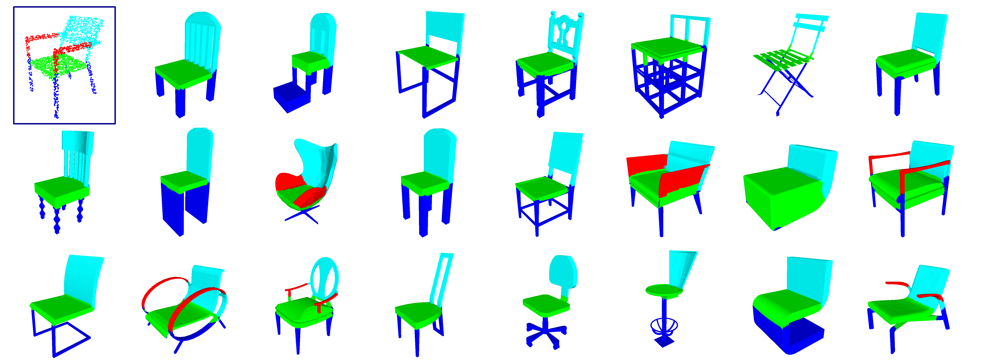
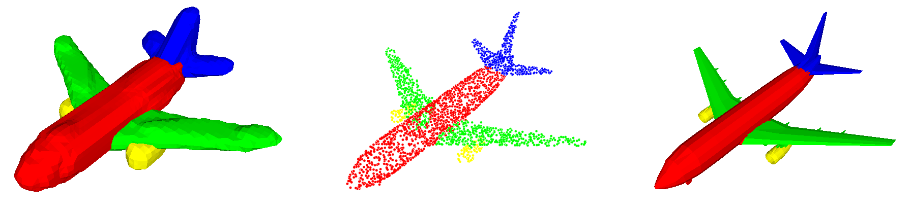

# BAE-NET
The tensorflow code for paper "BAE-NET: Branched Autoencoder for Shape Co-Segmentation", [Zhiqin Chen](https://www.sfu.ca/~zhiqinc/),  [Kangxue Yin](https://kangxue.org/),  [Matthew Fisher](https://techmatt.github.io/),  [Siddhartha Chaudhuri](https://www.cse.iitb.ac.in/~sidch/),  [Hao (Richard) Zhang](https://www.cs.sfu.ca/~haoz/).

### [Paper](https://arxiv.org/abs/1903.11228)  |   [Supplementary Material](https://www.sfu.ca/~zhiqinc/imseg/sup.pdf)





## Introduction
We treat shape co-segmentation as a representation learning problem and introduce BAE-NET, a branched autoencoder network, for the task. The unsupervised BAE-NET is trained with all shapes in an input collection using a shape reconstruction loss, without ground-truth segmentations. Specifically, the network takes an input shape and encodes it using a convolutional neural network, whereas the decoder concatenates the resulting feature code with a point coordinate and outputs a value indicating whether the point is inside/outside the shape. Importantly, the decoder is branched: each branch learns a compact representation for one commonly recurring part of the shape collection, e.g., airplane wings. By complementing the shape reconstruction loss with a label loss, BAE-NET is easily tuned for one-shot learning. We show unsupervised, weakly supervised, and one-shot learning results by BAE-NET, demonstrating that using only a couple of exemplars, our network can generally outperform state-of-the-art supervised methods trained on hundreds of segmented shapes.

## Citation
If you find our work useful in your research, please consider citing:

	@article{chen2019bae_net,
	  title={BAE-NET: Branched Autoencoder for Shape Co-Segmentation},
	  author={Zhiqin Chen and Kangxue Yin and Matthew Fisher and Siddhartha Chaudhuri and Hao Zhang},
	  journal={Proceedings of International Conference on Computer Vision (ICCV)},
	  year={2019}
	}

## Dependencies
Requirements:
- Python 3.5 with numpy, scipy and h5py
- [Tensorflow](https://www.tensorflow.org/get_started/os_setup)
- [PyMCubes](https://github.com/pmneila/PyMCubes) (optional, for marching cubes)

Our code has been tested with Python 3.5, TensorFlow 1.9.0, CUDA 9.1 and cuDNN 7.0 on Ubuntu 16.04.
It has also been tested on Windows 10 but something went wrong. If sigmoid is placed before reduce_max, sigmoid won't be executed in certain cases. The solution is to change the last few layers of the decoder from "linear - sigmoid - reduce_max" to "linear - reduce_max - sigmoid".


## Datasets and Pre-trained weights
We use the same point sampling method as in [IM-NET](https://github.com/czq142857/implicit-decoder).
For data preparation, please see directory [point_sampling](https://github.com/czq142857/BAE-NET/tree/master/point_sampling).

We provide the ready-to-use ShapeNet dataset, together with our pre-trained weights for one-shot training with 1/2/3 exemplars.
If you would like to try our 4-layer model, please uncomment "level 2_2" of the generator in "model.py".

- [ShapeNet dataset](https://drive.google.com/open?id=1NvbGIC-XqZGs9pz6wgFwwEPALR-iR8E0)
- [One-shot weights](https://drive.google.com/open?id=16VVhkmkdu6BpEcl4sE4E7_r4TOS45kMQ)
- [Two-shot weights](https://drive.google.com/open?id=1So2hvXEcR-4GYKoB_0G4VXIUzNpH0uf2)
- [Three-shot weights](https://drive.google.com/open?id=1gQQYa-JA9I4D8QZvrGgOo8biIPhkCGrJ)
- [One-shot weights for 4-layer model](https://drive.google.com/open?id=132wZcR-VDNxwWOVOoLy9gORD1iFGqGJM)

Backup links:
- [ShapeNet dataset (pwd: fytf)](https://pan.baidu.com/s/12mkWcn1PtfYXgUgI9Slqfg)
- [One-shot weights (pwd: 8ynb)](https://pan.baidu.com/s/1LjdP0X_Q6_Wu4hXZ6eJO6A)
- [Two-shot weights (pwd: ckx0)](https://pan.baidu.com/s/1mwazk9CeUTwFguELARL-Mg)
- [Three-shot weights (pwd: y8fp)](https://pan.baidu.com/s/19rwcauDQd8pl0PUp2eVqow)
- [One-shot weights for 4-layer model (pwd: b110)](https://pan.baidu.com/s/1ZzojiMWaTLJg8iOv-tOsQQ)


## Training

To perform one-shot training, use the following command:
```
python main.py --train --L1reg --supervised --iteration 200000 --pretrain_iters 3000 --retrain_iters 4 --dataset 03001627_vox --data_dir ./data/03001627_chair/ --checkpoint_dir checkpoint_1shot_1_3000 --supervision_list ref1.txt --sample_dir samples/03001627_chair  --real_size 32 --points_per_shape 8192
```
The above command will train the model (with L1 regularization) 200000 iterations after 3000 iterations of supervised-loss-only pretraining. It will do one supervised PASS (training all shapes in supervision_list using supervised loss) every 4 iterations of unsupervised training.
The file specified by "--supervision_list" should include the exemplars for supervised loss.
"--real_size 32 --points_per_shape 8192" means the training voxels are 32^3 and each shape has 8192 sampled points.

You can run the batch file "train_1shot.bat", "train_2shot.bat" and "train_3shot.bat" to train on all categories in ShapeNet.
```
sh train_1shot.bat
```
(or simply double click it if you are using Windows.)

To perform unsupervised training, please remove "--supervised":
```
python main.py --train --L1reg --iteration 200000 --dataset 03001627_vox --data_dir ./data/03001627_chair/ --checkpoint_dir checkpoint_1shot_1_3000 --sample_dir samples/03001627_chair  --real_size 32 --points_per_shape 8192
```
In default settings the decoder will have 8 branches.


## Evaluation and Visualization



To get the mean IOU on test shapes, replace "--train" with "--iou":
```
python main.py --iou --L1reg --supervised --iteration 200000 --pretrain_iters 3000 --retrain_iters 4 --dataset 03001627_vox --data_dir ./data/03001627_chair/ --checkpoint_dir checkpoint_1shot --supervision_list ref1.txt --sample_dir samples/03001627_chair  --real_size 32 --points_per_shape 8192
```
The IOU will be printed on the command prompt and saved to a txt in the checkpoint directory.


To visualize reconstructed shapes with colored segmentation, replace "--train" with "--recon" and specify the target shapes using "--supervision_list":
```
python main.py --recon --L1reg --supervised --iteration 200000 --pretrain_iters 3000 --retrain_iters 4 --dataset 03001627_vox --data_dir ./data/03001627_chair/ --checkpoint_dir checkpoint_1shot --supervision_list 03001627_test_vox.txt --sample_dir samples/03001627_chair  --real_size 32 --points_per_shape 8192
```


To visualize given point clouds with colored segmentation, replace "--train" with "--pointcloud" and specify the target shapes using "--supervision_list":
```
python main.py --pointcloud --L1reg --supervised --iteration 200000 --pretrain_iters 3000 --retrain_iters 4 --dataset 03001627_vox --data_dir ./data/03001627_chair/ --checkpoint_dir checkpoint_1shot --supervision_list 03001627_test_vox.txt --sample_dir samples/03001627_chair  --real_size 32 --points_per_shape 8192
```


To visualize given meshes with colored segmentation, replace "--train" with "--mesh" and specify the target shapes using "--supervision_list":
```
python main.py --mesh --L1reg --supervised --iteration 200000 --pretrain_iters 3000 --retrain_iters 4 --dataset 03001627_vox --data_dir ./data/03001627_chair/ --checkpoint_dir checkpoint_1shot --supervision_list 03001627_test_vox.txt --sample_dir samples/03001627_chair  --real_size 32 --points_per_shape 8192
```


Please see "test_reconstruction_1shot.bat", "test_pointcloud_1shot.bat", "test_mesh_1shot.bat" and "test_iou_1shot.bat" for more examples.


## License
This project is licensed under the terms of the MIT license (see LICENSE for details).


